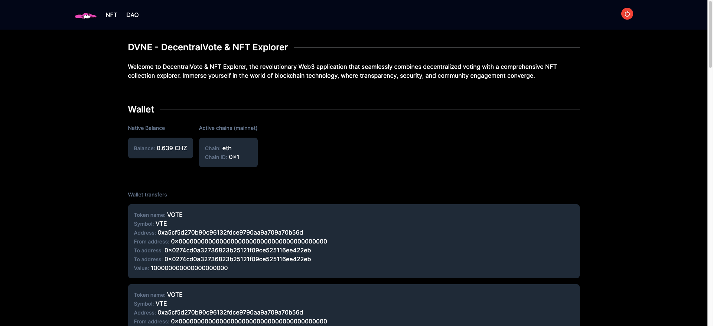
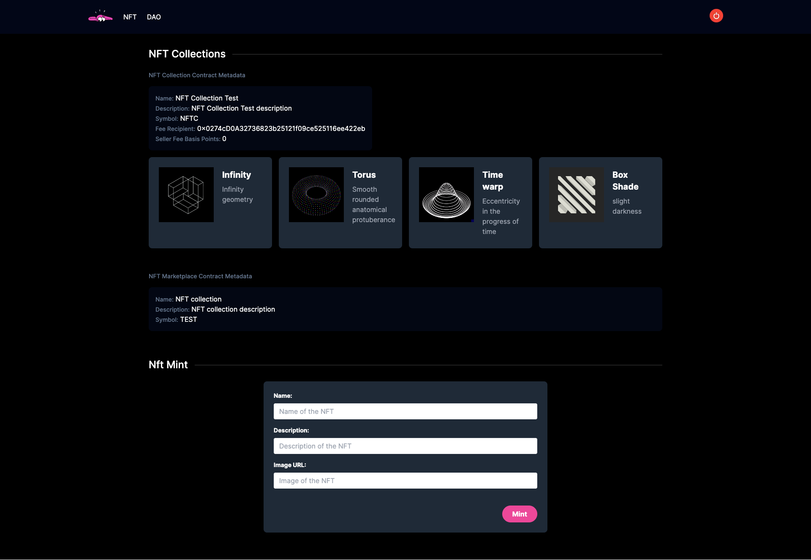
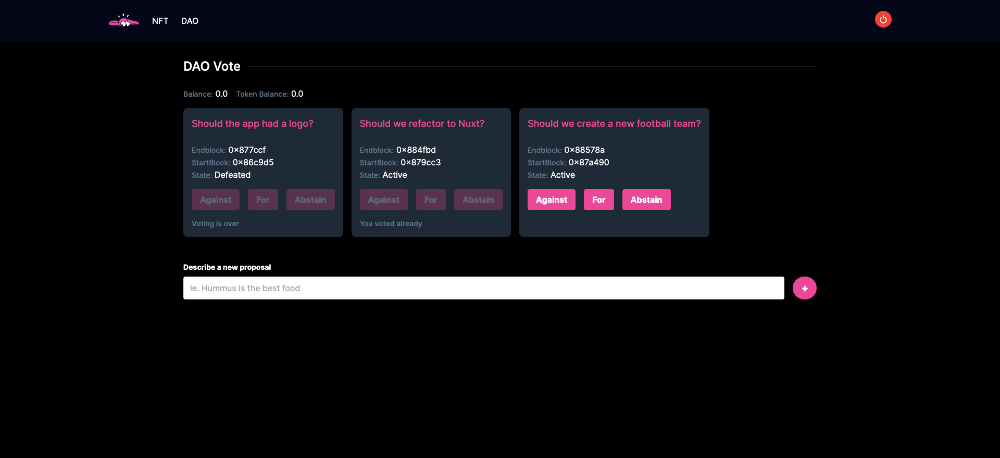

<!-- PROJECT LOGO -->
 

  

  <h3 align="center">DVNE - DecentralVote & NFT Explorer</h3>

<!-- TABLE OF CONTENTS -->

  
Table of Contents

  <ol>
    <li><a href="#about-the-project">About The Project</a></li>
    <li><a href="#built-with">Built With</a></li>
    <li><a href="#roadmap">Roadmap</a></li>
  </ol>

<!-- ABOUT THE PROJECT -->

## About The Project

Welcome to DecentralVote & NFT Explorer, the revolutionary Web3 application that seamlessly combines decentralized voting with a comprehensive NFT collection explorer. Immerse yourself in the world of blockchain technology, where transparency, security, and community engagement converge.

### Home

In the Home section users can visualize theirs wallet information, balance, transfers, transactions...

### NFT

In the NFT section you would be able to check your collections, marketplace and mint new NFT to your collection

### DAO

In the DAO section users would be able to Vote and create proposals

## Built With

- Next.js 14
- React 18
- Tailwind
- Moralis.io
- Thirdweb
- Chiliz

<!-- ROADMAP -->

## Roadmap

- [ ] Refactor logic in components into better hooks
- [ ] Refactor components creating better presentational ones
- [ ] Add transfer NFT feature
- [ ] Add sell NFT feature
- [ ] Improve NFT marketplace section
- [ ] Improve DAO section adding more actions and information
